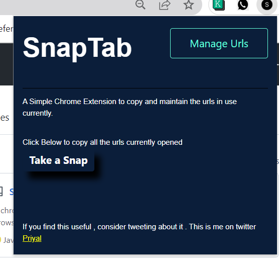
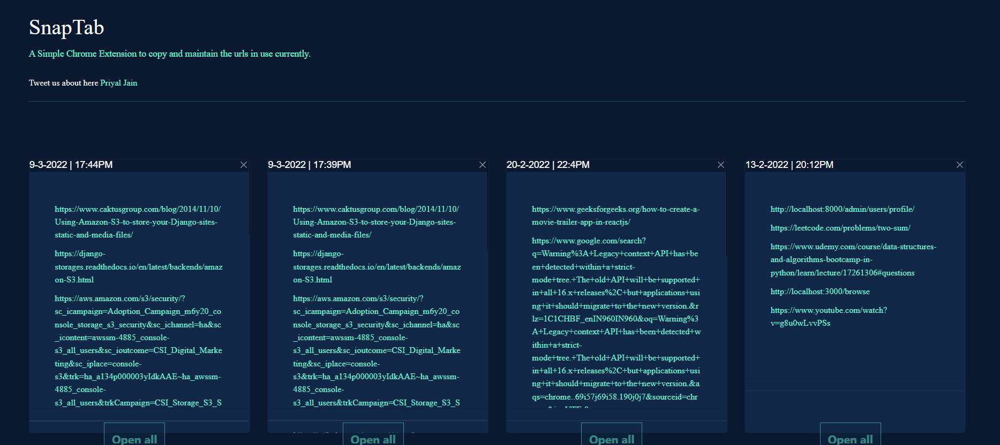

SnapTab
A chrome extension which captures all the urls of the Currently opened tabs at one click and stores it with timestamp like Notes.
User can easily access these urls later on .

User can Open all the urls at once or also access one link at a time from the same page .

